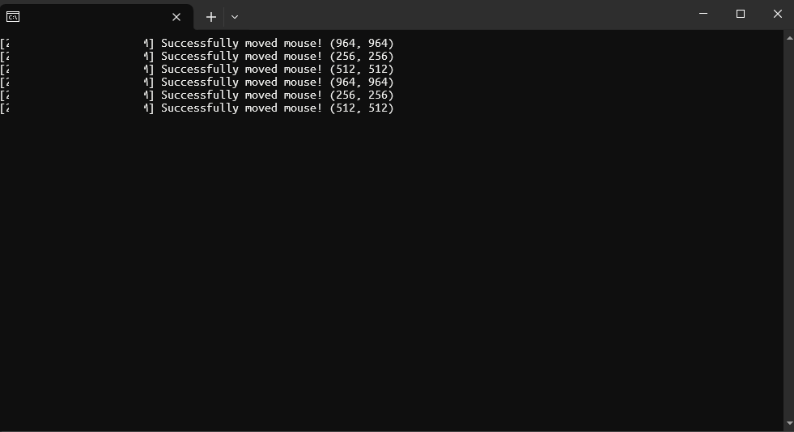

# mouse-mover
Simple AFK prevention

## Installation and Usage
1. Download the debug build from the Actions workflow or compile it yourself.
2. Run `mouse-mover.exe`

## Compatibility
- **Operating System**: Windows 10, Windows 11
- **Framework**: .NET 8.0
